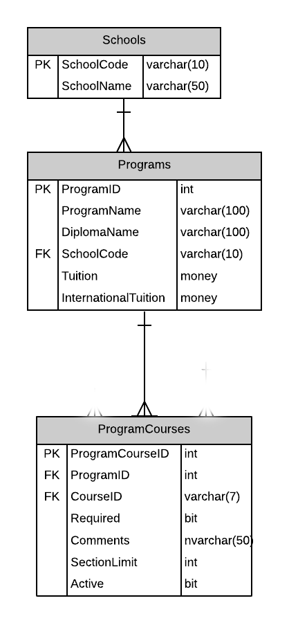

# A03: Programs

You must create two components (Query / CRUD) based on the following database tables. You will create the entities by using reverse engineering.

## Special NOTE:

When using the entity Program in variable declarations you **must** use the **fully qualified class name** as the datatype. Example: **MySystemName.Entities.Program** somepropertyname {get;set;}.  

Why? The web application project also has a class called Program. The system will get confused betweem the two if you do not use the fully qualified name.

## Query

> **Programs by Program Name** - Search with Tabular Results

Display the results of looking for Programs by Program Name. The user will be able to enter the program name or portion of the name. The result of the query will be a table presentation of the Programs who name contains the search argument. The SchoolCode will be displaying as the school name. Your program record must have the appropriate school name displayed. This mock-up demonstrates pagination. Remember you may also use tabular scrolling to limit the number of lines displayed.

**Future Deliverable Implementation Note**: Each program line will contain a link to allow for record maintenance. This link will cause your CRUD component to appear. Add a separate New button to have your CRUD appear.

## CRUD

> **Programs** - Single Item Create/Read/Update/Delete

**Note the following:**
- Use a select control to displays Schools, showing the school name. The select control is to have a prompt line.
- Programs with program courses cannot be removed.
- The same program can only belong to one school (no duplicate programs in the same school)
- Tuitions cannot be negative.

## Queries

These queries may be used in Deliverable 1 or Deliverable 2 or both. It is up to you to decide how and when to use. Some queries may not be required depending on the technique used to solve your project.

School List

Create a query that will return an ordered list of Schools. Order the list by school name.

Programs by Name

Create a query that will return an ordered list of Programs whos name contains the partial name string passed into it. Order the list by program name. Added parameters may be need if you are using paging.

Program by ID

Create a query that will return a program given a program id.

Program Course Count 

Create a query that will return the number of ProgramCourses associated with the Program instance given a program id.

[Back to catalogue of scenarios](./ReadMe.md)
